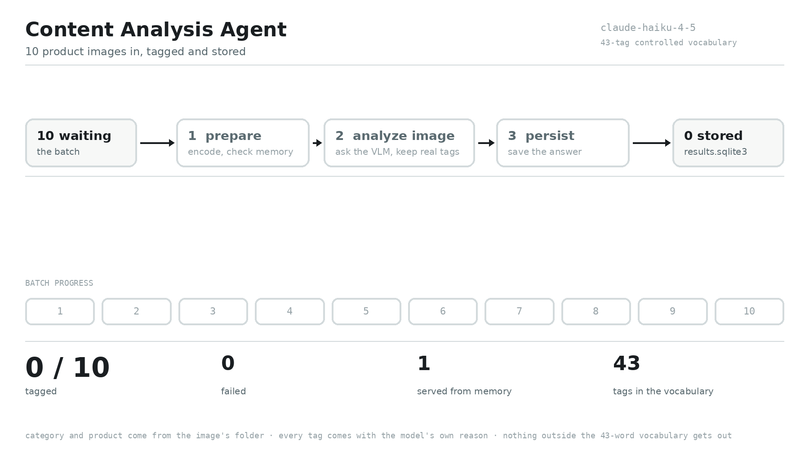
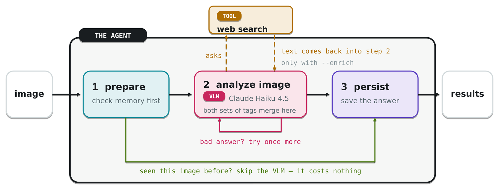

# Content Analysis Agent

Tags retail product images (Sony TV, mobile, audio) with marketing terminology from a fixed
43-word vocabulary, so a content team can ask which shots show the camera — and, by joining tags
to image views, which kinds of shot actually earn attention.

A small LangGraph agent on Claude Haiku 4.5, shared by a CLI and a Streamlit UI.



## Quick start

```bash
pip install -r requirements.txt
cp .env.example .env          # then add your ANTHROPIC_API_KEY
```

Tagging calls Claude, so the key is required. `pytest` is the only thing that runs without one.

```bash
python -m cli tag --input data/test --limit 10 --few-shot 8 --workers 8
streamlit run app/streamlit_app.py     # the Results tab shows what that wrote
```

## How it works



- **prepare** — encode the image, read `Category`/`Model` off its folder path, ask memory. A hit
  skips the model entirely.
- **analyze image** — the model proposes tags *and a reason for each*, plus what the vocabulary
  cannot say: category, model name, a one-line description, and any specs legible in the image.
  `--enrich` adds a web lookup for tags a photograph cannot show (awards, benchmark, energy
  rating). If nothing survives validation, or more tags were rejected than kept, the node runs
  once more with the rejected tags quoted back. Capped at two passes.
- **persist** — one memory row so an identical request is free next time, and one durable results
  row per image. A memory hit routes through here too, so ten images are always ten rows.

Validation is the guardrail: anything outside `agent/taxonomy.json` is dropped, so neither the
model nor the search tool can invent a tag. The feedback sent into the retry names only the
*rejected* tags, never the right answer, so a second attempt stays independent evidence.

All three entry points compile the same graph through `build_graph`, so a change reaches every one.

## Commands

| Command | What it does |
| --- | --- |
| `taxonomy` | Print the 43-tag controlled vocabulary |
| `tag --input DIR` | Tag a folder; `--output` writes JSON or CSV |
| `eval --train-dir DIR` | Score against the labels in the training filenames, versus baselines |
| `tag --consistency` | Tag twice with different examples and score the agreement (no labels needed) |
| `insights --from-sheet` | Rank tags by engagement using the metadata sheet |

Useful flags: `--few-shot N`, `--workers N`, `--enrich`, `--no-memory`, `--no-db`.

Every run writes a timestamped JSON record to `results/` — the settings, what came back, and what
it cost. `tag` also writes one row per image into `results.sqlite3`, which is what the app's
**Results** tab reads: tags, the model's reason for each, description, specs and highlights, with
a CSV download.

## Results

Claude Haiku 4.5, `--few-shot 8`, scored leave-one-out over the 8 labelled training images — the
image being scored is dropped from its own example list, so the model never sees its own answer.

| Run | micro-F1 | macro-F1 |
| --- | --- | --- |
| constant baseline (always `physical design`) | 0.516 | 0.100 |
| prior top-3 baseline | 0.638 | 0.221 |
| **agent** | **0.745** | **0.555** |

That run cost **$0.0068 per image**, and the model call took **1.75 s at p50**. Re-run it with
`python -m cli eval --train-dir data/train --few-shot 8`, which writes the full record to
`results/`.

Read it as directional, not a benchmark: n=8, all one phone model, and the model is not
deterministic, so repeat runs move by several points. What it does establish is that the agent
clears both label-prior baselines on both metrics — on this data "always guess the commonest tags"
is a high floor, because `physical design` appears in every label.

Micro-F1 asks whether the tags are right; macro-F1 weights every tag equally, so it asks whether
the *rare* tags are right too. A model that only ever predicts the two commonest tags scores well
on the first and badly on the second.

From the metadata sheet, tags on images that earn views (n=44): `awards` 1.68×, `product summary`
1.67×, `person` 1.47× the average, against `connectivity` 0.52×. Social proof and orienting shots
out-perform spec detail.

## Layout

```
agent/        the agent: graph, vlm, taxonomy, prompts, memory, enrichment, retry, logging
tools/        what it calls: search.py for non-visual tags, database.py for the results
evaluation/   quality.py (vs labels), runstats.py (workflow), consistency.py
data/         images, meta_data.xlsx, and metadata.py: tags joined to image views
cli/          terminal entry point, one module per subcommand
app/          Streamlit UI: tag uploads, the results table, the metrics tab
tests/        118 offline tests
```

Dependencies point inward: the outer folders import `agent`; it imports none of them at runtime.

## Tests

```bash
pytest        # 118 tests, ~1.3 s, no network and no API key
```

Fixtures synthesise their own images, so a fresh clone runs them despite the dataset being
gitignored.

## Notes on the data

- Only **8 labelled training images** exist, all of one phone and almost all tagged
  `physical design`, so evaluation measures angle vocabulary and says little about
  `feature graphics` or `usage scene`.
- `meta_data.xlsx` describes the **training** images only. None of the 107 test images appear in
  it, and views exist for 44 of its 151 rows. Its 12 product models do not overlap the test set's
  (it has `XPERIA1MK4`; the test folder has `XPERIA1MK5`), so no price or view count can be joined
  to a test image, and the results table hides those two columns rather than showing blanks.
- Image files are gitignored; only the folder skeleton is committed.
